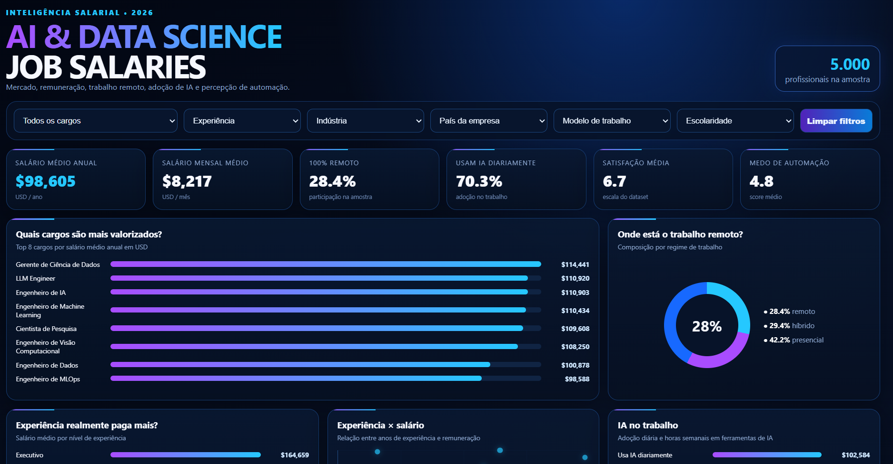

# AI & Data Science Job Salaries 2026

Dashboard interativa desenvolvida para análise de salários e características profissionais do mercado de Inteligência Artificial e Ciência de Dados em 2026.

O projeto utiliza uma base com **5.000 registros** e busca transformar dados sobre cargos, experiência, remuneração, trabalho remoto, adoção de ferramentas de IA e satisfação profissional em informações úteis para análise do mercado de trabalho.

---

## Dashboard
laries
[](https://juliasenna13.github.io/Netflix-Catalog-Analytics/)

---

## Sobre o projeto

A base utilizada contém informações sobre profissionais de diferentes cargos relacionados a dados e Inteligência Artificial, incluindo:

- cargo;
- nível de experiência;
- tipo de contratação;
- porte da empresa;
- localização da empresa;
- residência do profissional;
- setor de atuação;
- percentual de trabalho remoto;
- anos de experiência;
- escolaridade;
- linguagem de programação principal;
- uso diário de ferramentas de IA;
- horas semanais utilizando ferramentas de IA;
- salário anual em USD;
- participação acionária oferecida;
- percentual de bônus;
- satisfação profissional;
- horas mensais dedicadas ao desenvolvimento de novas habilidades;
- percepção de medo em relação à automação por IA.

A dashboard concentra a análise em **remuneração, experiência, trabalho remoto, adoção de IA, satisfação profissional e oportunidades por cargo**.

---

## Objetivos

- Analisar a remuneração dos profissionais de IA e Ciência de Dados.
- Identificar quais cargos apresentam os maiores salários médios.
- Avaliar a relação entre experiência profissional e remuneração.
- Explorar a distribuição entre trabalho presencial, híbrido e remoto.
- Analisar a adoção de ferramentas de IA no ambiente profissional.
- Comparar características dos cargos para identificar oportunidades no mercado.
- Aplicar conceitos de Business Intelligence, Data Visualization e UX/UI.
- Desenvolver um projeto interativo para portfólio de Análise de Dados.

---

## Perguntas de negócio

A dashboard foi estruturada para apoiar principalmente as seguintes análises:

### 1. Quais cargos são mais valorizados?

O ranking por salário médio anual permite comparar os cargos da base e identificar quais funções apresentam maior remuneração média.

### 2. Onde está o trabalho remoto?

A distribuição por regime de trabalho permite visualizar a participação de profissionais presenciais, híbridos e 100% remotos.

### 3. Experiência realmente paga mais?

A comparação do salário médio por nível de experiência permite avaliar como a remuneração varia entre profissionais Júnior, Pleno, Sênior, Líder e Executivo.

### 4. Qual é a relação entre experiência e salário?

O gráfico de dispersão relaciona os anos de experiência com o salário anual em USD, permitindo observar padrões e diferenças de remuneração entre profissionais.

### 5. Como a adoção de IA se relaciona com a remuneração?

A dashboard compara o salário médio de profissionais que utilizam ferramentas de IA diariamente com aqueles que não utilizam diariamente.

### 6. Quais cargos apresentam oportunidades mais atrativas?

O Radar de Oportunidades combina informações de salário médio, uso diário de IA, satisfação profissional e trabalho remoto para facilitar a comparação entre cargos.

---

## KPIs

A dashboard apresenta seis indicadores principais:

| KPI | Cálculo |
|---|---|
| **Salário médio anual** | Média de `salary_usd` |
| **Salário mensal médio** | Média de `salary_usd` ÷ 12 |
| **100% remoto** | Percentual de registros com `remote_ratio = 100` |
| **Usam IA diariamente** | Percentual de profissionais com `uses_ai_tools_daily = true` |
| **Satisfação média** | Média de `job_satisfaction_score` |
| **Medo de automação** | Média de `fears_ai_automation_score` |

Sem filtros aplicados, a base apresenta salário médio anual de aproximadamente **US$ 98.605** e salário mensal médio equivalente a aproximadamente **US$ 8.217**.

Os indicadores são recalculados automaticamente de acordo com os filtros selecionados.

---

## Filtros

A dashboard permite segmentar a análise pelos seguintes campos:

- **Cargo**
- **Experiência**
- **Indústria**
- **País da empresa**
- **Modelo de trabalho**
- **Escolaridade**

As opções dos filtros são apresentadas em ordem alfabética e os dados categóricos exibidos na interface foram traduzidos para português quando aplicável.

---

## Visualizações

A dashboard reúne as seguintes análises:

### Ranking de salários por cargo

Apresenta os **8 cargos com maior salário médio anual**, permitindo identificar rapidamente as funções mais valorizadas.

### Distribuição do trabalho remoto

Mostra a composição dos registros entre:

- presencial;
- híbrido;
- remoto.

### Salário por nível de experiência

Compara o salário médio entre os diferentes níveis profissionais.

### Experiência × salário

Utiliza um gráfico de dispersão para analisar a relação entre anos de experiência e remuneração.

### IA no trabalho

Compara o salário médio entre profissionais que utilizam IA diariamente e aqueles que não utilizam, além de apresentar:

- média de horas semanais utilizando ferramentas de IA;
- média de horas mensais dedicadas ao desenvolvimento de novas habilidades.

### Radar de Oportunidades

Apresenta uma tabela dinâmica com os cargos de maior salário médio e as seguintes métricas:

- salário médio;
- percentual de uso diário de IA;
- satisfação média;
- percentual de profissionais 100% remotos.

### Leitura executiva

Gera um resumo dinâmico da seleção atual, destacando o cargo com maior salário médio, o nível de experiência mais remunerado, a adoção diária de IA e a participação do trabalho 100% remoto.

---

## Interatividade

Todos os principais componentes respondem aos filtros aplicados.

Ao alterar uma seleção, são recalculados dinamicamente:

- KPIs;
- rankings;
- distribuição do modelo de trabalho;
- salário por experiência;
- gráfico de dispersão;
- comparação de uso de IA;
- Radar de Oportunidades;
- Leitura Executiva.

Também está disponível a opção **Limpar filtros**, permitindo retornar rapidamente à visão geral da base.

---

## UX/UI

A identidade visual foi inspirada em estética tecnológica utilizando:

- fundo azul-marinho;
- tons de azul, ciano e roxo;
- alto contraste;
- cards de indicadores;
- elementos visuais com efeito neon discreto;
- hierarquia visual voltada à leitura rápida dos principais resultados;
- layout responsivo para diferentes tamanhos de tela.

A proposta visual busca combinar uma estética tecnológica com legibilidade e organização das informações.

---

## Tecnologias e ferramentas

### Desenvolvimento

- HTML5
- CSS3
- JavaScript

### Dados e análise

- CSV
- análise exploratória de dados
- definição de KPIs
- análise de salários e mercado de trabalho

### Conceitos aplicados

- Business Intelligence
- Data Analysis
- Data Visualization
- UX/UI para dashboards
- storytelling com dados
- análise de tendências e desempenho
- filtros e segmentação de dados

### Versionamento e publicação

- Git
- GitHub
- GitHub Pages

---

## Estrutura sugerida do repositório

```text
AI-Data-Science-Job-Salaries-2026/
│
├── ai_ds_job_salaries_2026.csv
├── Dashboard.png
├── index.html
└── README.md
```

---

## Como executar

### GitHub Pages

Pode ser acessada diretamente pelo navegador: https://juliasenna13.github.io/AI-Data-Science-Job-Salaries-2026/

### Localmente

1. Clone o repositório:

```bash
git clone https://github.com/juliasenna13/AI-Data-Science-Job-Salaries-2026.git
```

2. Entre na pasta do projeto:

```bash
cd AI-Data-Science-Job-Salaries-2026
```

3. Abra o arquivo:

```text
index.html
```

em um navegador.

---

## Dados utilizados

O dataset possui **5.000 registros** e **27 campos**.

Na verificação da base utilizada para a dashboard:

- não foram identificados valores nulos;
- não foram identificadas linhas totalmente duplicadas;
- existem 12 cargos distintos;
- existem 5 níveis de experiência;
- existem 10 setores de atuação;
- o modelo de trabalho é representado pelos valores 0%, 50% e 100% de trabalho remoto.

A remuneração utilizada nas análises é o campo **`salary_usd`**, que representa o salário anual convertido para dólares americanos.

---

## Principais aprendizados

O projeto permitiu aplicar um fluxo de análise orientado a perguntas de negócio:

**dados → análise → perguntas de negócio → KPIs → visualizações → interatividade → insights**

Durante o desenvolvimento foram praticados conceitos relacionados a:

- análise exploratória de dados;
- seleção de métricas relevantes;
- definição de KPIs;
- construção de rankings;
- análise de remuneração;
- análise de experiência profissional;
- segmentação por filtros;
- visualização de relações entre variáveis;
- desenvolvimento de dashboards interativos;
- organização da informação;
- UX/UI aplicada à visualização de dados;
- publicação de projetos no GitHub.

---

## Limitações e próximas melhorias

A dashboard apresenta uma análise descritiva e exploratória da base fornecida.

Como evolução do projeto, podem ser implementados:

- comparação salarial por país;
- análise por setor de atuação;
- análise de remuneração total considerando bônus e participação acionária;
- comparação entre tipo de contratação e salário;
- análise do impacto da escolaridade na remuneração;
- análise das linguagens de programação por cargo;
- indicadores de gestão de pessoas e tamanho das equipes;
- análise mais aprofundada da relação entre adoção de IA e remuneração;
- versão do projeto em Power BI;
- documentação detalhada da análise exploratória.

As relações apresentadas na dashboard devem ser interpretadas como **associações observadas no dataset**, e não como relações de causa e efeito.

---

## Autora

**Júlia Senna**

Projeto desenvolvido para estudo e construção de portfólio em **Análise de Dados e Business Intelligence**.

GitHub: https://github.com/juliasenna13
